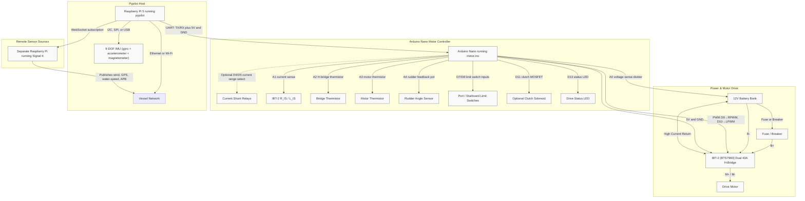

# Pypilot Autopilot System Diagram

The diagram below summarizes the electrical and data connections for the pypilot installation described in the recent discussion. It combines the high-current drive path, Arduino Nano servo controller, Raspberry Pi 5 running pypilot, the remote Signal K server, and the supported sensors/actuators.

## Notes

- **Grounding:** The battery negative (B-), IBT-2 ground, Arduino ground, and Raspberry Pi ground must all be common to ensure valid logic-level signals and telemetry measurements. If opto-isolation is used between the Pi and Nano, supply isolated 5V/GND on the isolated side.
- **Power protection:** Place a suitably rated fuse or breaker close to the battery to protect the high-current wiring feeding the IBT-2 module.
- **Sensor calibration:** The 9-DOF IMU connects directly to the Raspberry Pi 5 and is calibrated via the `pypilot_calibration` tool to provide gyro, accelerometer, and compass data to pypilot.
- **Telemetry:** The Arduino forwards voltage, current, thermistor temperatures, rudder angle, and limit switch states to the Pi via the 4-byte serial protocol built into `motor.ino`.
- **Remote data:** Wind, GPS, water-speed, and route/APB data can be consumed from the remote Signal K server once pypilot authenticates and subscribes to its WebSocket feed.
